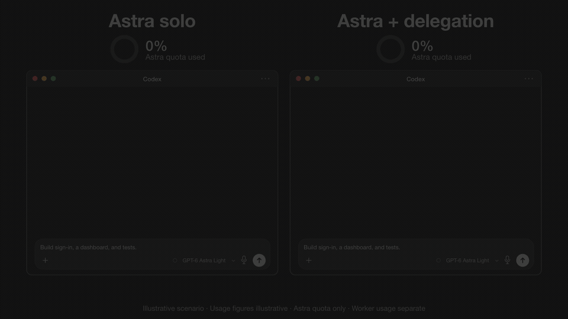

# pragmatic-orchestration

`pragmatic-orchestration` is a field-tested system for orchestrating coding agents across vendors. Its cross-agent skill turns any skill-capable harness into an orchestrator: Codex, Claude Code, Cursor, OpenCode, and others can call external agents through the `porch` CLI.

In field use, frontier models such as Astra and Fable cover roughly 2–10× more work with practically no loss of quality when they orchestrate and cheaper executors implement. The best fit is autonomous work lasting hours or days, producing tens to hundreds of thousands of lines of code.

The repo ships two skills in the Agent Skills layout: `pragmatic-orchestration` and `remote-agents`. `porch` provides four modes:

- **review** — independent opinions or multi-depth code review from several model families at once (read-only).
- **delegate** — hand a task to one exact agent: steerable by default, detachable, with `wait` / `watch` / `events` / `list` to supervise long-running work (full-access runtime).
- **sessions** — search and navigate local coding-agent session histories.
- **quota** — read remaining Codex / Grok subscription quota.

Supported worker harnesses: Codex CLI, Claude Code, OpenCode, Grok Build, Devin CLI, and Gemini CLI (review only).

The repo also ships **`remote-agents`**: a companion skill for operating dedicated remote Linux/Windows hosts that run these agents — secure VM/OS provisioning, SSH-over-SSM access with no public ingress, the WireGuard/SMB work bridge, `porch` on the remote host, a headless Windows desktop, bounded visual QA, durable worker daemons, and Codex Remote threads. See [skills/remote-agents/SKILL.md](skills/remote-agents/SKILL.md).

Full documentation: [skills/pragmatic-orchestration/README.md](skills/pragmatic-orchestration/README.md) and [SKILL.md](skills/pragmatic-orchestration/SKILL.md).

## Demo



*Illustrative scenario. Usage figures show Astra quota only; worker usage is separate.*

## Recommended combinations

These combinations come from field use.

| Priority | Orchestrator → executor | Tradeoff |
|---|---|---|
| Best quality | Astra Light or Fable Low → Sol low or Opus low | Very high quality. Quotas still get consumed, but several times slower than using frontier models end-to-end. Opus low lasts longest as executor. |
| Quality/quota balance | Sol medium → Devin SWE 2.0, with Astra as planner | Devin SWE 2.0 is free on the $20 subscription until October 15, 2026. |

For planning, use Astra medium+ or Fable, guided by the `code-that-fits-in-your-head` skill (`~/.claude/skills/code-that-fits-in-your-head/SKILL.md`). Having the orchestrator and planner consult each other works well.

## Delegation discipline

[references/delegate.md](skills/pragmatic-orchestration/references/delegate.md) collects the practices that address common subagent delegation failures:

- Write a precise task contract: purpose, exact working root, scope, compatibility constraints, anticipated pitfalls, acceptance criteria, and required checks.
- Check every worker within its first minute. Inspect actual actions and findings, then adapt supervision to risk and progress; 5–15 minutes is the suggested follow-up interval.
- Require a deviation journal when delegating to a less capable model. Record unexpected findings, evidence, actions, and unresolved risks. Read-only workers return it in their final answer.
- Do not retry blindly. Inspect events and partial work, send only new guidance, and confirm a writer has stopped before assigning overlapping work to a replacement.
- The parent owns verification. Inspect the diff and surrounding code, verify the checks, then reconcile the entire deviation journal. A worker's summary or successful exit is not enough.

## Orchestration tips

- Have the orchestrator keep its plan and progress in a Markdown file so context compaction cannot erase them.
- In Codex, use a cron reminder every 15–30 minutes. `goal` consumes quota quickly.
- Periodically ask whether enough work is running in parallel. Put that question in the cron description or install a hook to prompt it.
- With Claude Code as orchestrator, cap context at about 300k tokens with `/autocompact 300000` to limit context rot. Keep updating the progress file.
- Use Jujutsu (`jj`) for parallel work. Its flexible conflict, rebase, and commit-moving semantics let conflicts accumulate for the orchestrator to resolve later in one pass.
- Regularly have a strong model analyze session transcripts to assess subagent effectiveness and the orchestration flow.
- If workers spend hours without progress and the orchestrator cannot redirect them, stop all work and intervene. Continuing the same loop makes it worse.

## Install

Any agent supporting the Agent Skills standard:

```bash
npx skills add CodeAlive-AI/pragmatic-orchestration@pragmatic-orchestration -g -y
```

As a Claude Code plugin:

```bash
claude plugin marketplace add CodeAlive-AI/pragmatic-orchestration
claude plugin install pragmatic-orchestration@pragmatic-orchestration
```

You also need Python 3 and at least one supported coding-agent CLI installed and authenticated.

Configuration: copy `skills/pragmatic-orchestration/config.example.json` to `config.json` in the same directory (gitignored, per-user) or point `PORCH_CONFIG` at your own file. Without `config.json`, the shipped example defaults are used. `remote-agents` follows the same pattern (`REMOTE_AGENTS_CONFIG` / `config.json`).

## Platform support

The system is fully field-tested on macOS. Linux and Windows 11 support is experimental: both are covered by CI but have less field use. CI runs on Ubuntu, macOS, and Windows.

Windows 11 requires Git Bash/MSYS2 and native Python 3.11+. `porch.cmd` runs `sessions` and `quota` natively; `review` and `delegate` run from Git Bash.

## Repository layout

```
pragmatic-orchestration/
├── .claude-plugin/            ← single-plugin marketplace (source: "./")
├── skills/
│   ├── pragmatic-orchestration/
│   │   ├── SKILL.md           ← agent-facing instructions
│   │   ├── README.md          ← human-facing docs
│   │   ├── scripts/porch      ← the CLI (+ porch.cmd for Windows)
│   │   ├── references/        ← per-mode deep docs
│   │   ├── prompts/           ← review/specialist prompt templates
│   │   └── config.example.json
│   └── remote-agents/         ← dedicated remote agent hosts (Linux/Windows)
│       ├── SKILL.md           ← agent-facing instructions
│       ├── scripts/           ← host.sh, desktop.py, work-bridge.py, Windows helpers
│       ├── references/        ← provisioning, bridge, porch-remote, security…
│       └── config.example.json
└── .github/workflows/         ← offline regression CI
```

## History

Extracted from [CodeAlive-AI/ai-driven-development](https://github.com/CodeAlive-AI/ai-driven-development) (`skills/agents-consilium`) via `git filter-repo`; commit history preserved (SHAs rewritten). Earlier pre-consolidation history lives in the archived `CodeAlive-AI/awesome-agent-skills` repository.

## License

MIT — see [LICENSE](LICENSE).
