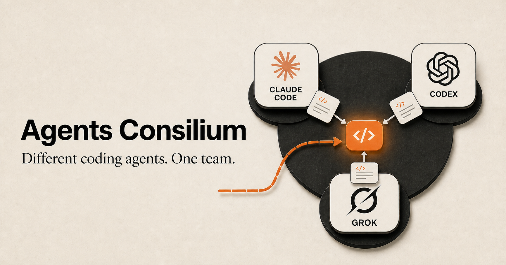

# pragmatic-orchestration



Use other coding agents as subagents — even when your primary agent does not support their models.

Most coding agents can only spawn copies of themselves or a small built-in model set. `pragmatic-orchestration` removes that boundary. Any coding agent that can run the skill can call a different coding-agent CLI to research, review, or implement work.

For example:

- send repository research to a stateful Grok 4.6 worker that can be steered and continued, with Grok 4.5 available as a fast context-research profile;
- ask Claude Fable to produce an independent plan;
- delegate an implementation to Codex, Claude, Grok, OpenCode, or Devin;
- review the same change with several unrelated model families and compare what they find.

Each worker runs through its real coding-agent harness, with access to the tools and repository context appropriate for the selected mode. This is not role-play inside one model.

**Steering support:** long-running delegated agents are not fire-and-forget. You can send new guidance while they work, redirect the next turn, inspect status, watch progress, cancel a run, or detach and collect the result later.

## Platform support

Linux and macOS are covered by the full offline regression suite. Windows 11
with Git Bash/MSYS2 and native Python 3.11+ has experimental, community-supported
compatibility. `porch.cmd` runs `sessions` and `quota` natively (cmd,
PowerShell, or Git Bash all work — store roots resolve to `%APPDATA%` /
`%LOCALAPPDATA%` / `%USERPROFILE%` automatically, see
[references/session-history.md](references/session-history.md#platform-defaults)).
`review` and `delegate` run from Git Bash; native PowerShell/cmd invocation is
not the shell interface for those modes.

CI checks Windows imports, LF config output, cross-process locking, bounded
observation, process-tree cancellation, CLI launchers, and a fake Codex durable
session/follow-up through the native supervisor. The full POSIX shell harness
and every real provider CLI are not yet Windows-certified.

Native executables and sh/bash, Python, and Node shebang launchers are supported.
For npm installs, the sibling shell launcher is preferred over a batch shim.
Batch-only launchers reject shell metacharacters in arguments; use an executable
or supported shebang launcher when those arguments are needed. Keep the Windows
registry in the default per-user LocalAppData directory (or an equally private
location): POSIX uid/mode checks do not implement Windows ACL isolation.

Installed plugin updates replace vendored files. Submit fixes upstream; local
edits inside an installation are not a persistent customization mechanism.

## Two ways to use it

| Mode | What it does | Repository access |
|---|---|---|
| `review` | Gets independent opinions or reviews code with multiple agents | Read-only |
| `delegate` | Gives one exact agent a task, with optional live steering and detached execution | Full read/write access |
| `sessions` | Searches and navigates local coding-agent session histories | Read-only |

In short:

```text
Need several opinions?         review
Need research or execution?    delegate
Need to find a past session?   sessions
```

## Install

```bash
npx skills add CodeAlive-AI/pragmatic-orchestration@pragmatic-orchestration -g -y
```

You also need Python 3 and at least one supported coding-agent CLI:

| Agent harness | Command | Supported modes |
|---|---|---|
| [Codex CLI](https://github.com/openai/codex) | `codex` | review, delegate |
| [Claude Code](https://docs.claude.com/claude-code) | `claude` | review, delegate |
| [OpenCode](https://opencode.ai) | `opencode` | review, delegate |
| [Grok Build](https://grok.x.ai) | `grok` | review, delegate |
| [Devin CLI](https://devin.ai) | `devin` | review, delegate |
| [Gemini CLI](https://github.com/google-gemini/gemini-cli) | `gemini` | review only |

Authentication stays with each CLI. If it already works in your terminal, Porch can use it.

The examples below abbreviate the entrypoint as `scripts/porch`. When running it manually, use the installed script's absolute path and keep your shell in the repository you want the worker to inspect or change.

## Quick start

List the configured workers:

```bash
scripts/porch --list-agents
```

### Ask several model families

```bash
scripts/porch review ask -a grok,claude-fable,opencode-go-kimi-k3 \
  "Propose a migration plan from REST to event-driven processing."
```

The agents work independently. Their answers are returned under separate headings so your primary agent — or you — can compare them without an artificial consensus.

### Use Grok as a stateful repository researcher

```bash
scripts/porch delegate -a grok \
  "Read-only investigation: trace authentication from the HTTP entry point to authorization checks. Cite repository-relative files and do not edit anything."
```

Run the command from the repository Grok should inspect. The worker keeps a real session, so an incomplete investigation can continue through `delegate steer` and its final answer can be collected with `delegate wait`. Delegation is still a full-access runtime: a read-only research task is an instruction to the worker, not a sandbox guarantee, so the caller must verify that no files changed.

For a remote repository, check it out into a user-approved working directory first and run Porch there. Porch no longer owns a separate clone-and-cleanup path.

### Ask GPT-6 Astra for a difficult second opinion

GPT-6 Astra is disabled in the default review pool. Select it explicitly when a difficult specification or optimization plan benefits from an independent second view:

```bash
scripts/porch review ask --progress compact -a codex \
  "Verify SPEC.md against the implementation and identify mismatches."
```

Claude Code defaults to `claude-opus` (Opus 5.5, `medium` effort).
Fable remains available by explicitly selecting `-a claude-fable`.

### Ask Claude Fable 5.1 for a plan

```bash
scripts/porch review ask -a claude-fable \
  "Create a step-by-step implementation plan for DESIGN.md. Do not edit files."
```

### Delegate real work to another agent

```bash
scripts/porch delegate -a grok \
  "Implement the caching layer described in DESIGN.md and run the relevant tests."
```

`delegate` runs exactly one explicitly selected agent in the current directory and is steerable by default. It has no sandbox or approval prompts, so use it only when you intend to give that agent full control of the repository. Use `--one-shot` for the legacy direct execution path.

When delegating to a less capable model, the calling agent must provide a precise
task contract, anticipate task-specific pitfalls, and request a deviation journal
at `docs/tmp/{yyyy.MM.dd}_{task-name}_deviations.md` with a concrete date and task
name. After completion, the caller reviews the code itself, then reads and
reconciles the journal before accepting the result. This is an agent workflow,
not automatic model ranking by the CLI. See the
[delegate protocol](references/delegate.md#delegating-to-a-less-capable-model),
including the reporting rule for strictly read-only investigations.

### Review code with independent specialists

```bash
# Security + correctness
scripts/porch review code path/to/file.py

# Security, correctness, performance, architecture, and consistency
scripts/porch review code --depth specialists path/to/file.py

# Review a diff
git diff HEAD | scripts/porch review code --diff
```

For deeper, multi-stage reviews with a final judge, use `--depth super` or `--depth ultra`.

## Long-running delegation

The parent must check the worker within the first minute after launch to verify
its understanding and initial direction, and correct it when needed. Afterwards,
the parent chooses when to check based on the task and observed progress;
every 5–15 minutes is recommended depending on task scale: closer to 5 for
smaller tasks, closer to 15 for larger tasks making steady progress. This is
guidance, not a fixed schedule.
It uses `delegate events` to inspect the work and sends a concrete
`steer --mode auto` correction when needed. Healthy progress needs no steer.
When progress is unclear, the parent requests evidence, resolves a blocker, or
adjusts the approach, then verifies whether that helped. Heartbeats alone do not
justify repeated waiting; changing approach does not require proving a hang. A replacement writer starts
only after the old one has stopped and its changes have been inspected. Further
reviews need a concrete change, unresolved risk, or required check.
The parent can also inspect Git diffs or saved JJ change evolution when useful,
without snapshotting a worker's working copy. See [VCS observation](references/delegate-vcs.md).
The CLI does not schedule supervision automatically.

Use `--detach` when work should continue after the calling session exits:

```bash
RUN_ID=$(scripts/porch delegate -a grok --detach \
  "Implement the task in SPEC.md and run the test suite.")

scripts/porch delegate events "$RUN_ID" --max-events 50
scripts/porch delegate wait "$RUN_ID" --timeout 300 --json
```

`watch` is a lifecycle monitor, not a live tool or model-text stream. It reports
selected run/steer/turn transitions, heartbeats, and terminal state; use `wait`
to print the final answer. `--detach` changes process lifetime, and steerability
enables control commands—neither adds tool/file-level visibility. Private
registry files and `audit.jsonl` are diagnostic internals, not monitoring APIs.

Every normal delegate is steerable, so the caller can add guidance or change direction while the worker is running:

```bash
scripts/porch delegate -a grok \
  "Refactor the storage layer."

# From another process, using the run_id printed at startup
scripts/porch delegate steer run_<id> --mode auto \
  "Keep the public API backward compatible."
scripts/porch delegate status run_<id> --json
scripts/porch delegate cancel run_<id>
```

`list --active` recovers a lost run id. `wait` returns the full final answer and never cancels the worker.

You can bound observation or wait for any of several workers:

```bash
scripts/porch delegate wait "$RUN_ID" --timeout 300 --json
scripts/porch delegate wait-any "$RUN_A" "$RUN_B" --timeout 300
```

Exit 124 means the wait expired while workers continue. `wait-any` returns JSON
with ready ids and recent progress; collect finals with `wait` and remove consumed
ids before waiting again. Each worker is launched separately from its working root.

For Codex work that will need follow-up, start with `--persist-session`. After
reviewing its successful result, send a new instruction with
`delegate -a codex --continue-run RUN_ID "Follow-up"` from the same directory and
profile. It creates a new run using the saved native conversation. Only the latest
successful turn can continue; failed or ambiguous work is never replayed, and
unavailable resume does not silently start over. Ordinary runs remain ephemeral.

## Session history search

`sessions` reads the session stores your coding agents already write —
Claude Code, Codex CLI/Desktop, OpenCode, Grok, Devin CLI, Gemini, Cursor,
Qwen Code, Kimi Code, OMP, Claude Desktop, and Porch's own runs. It
creates no index or database; every record carries a native locator
(file:line or db table:key) back to the raw source.

Multi-layer stores keep their authority straight: Codex surfaces the
canonical `rollout-*.jsonl` bodies, the `state_*.sqlite` thread index
(with subagent `thread_spawn_edges` lineage), the Desktop sidebar catalog
(`codex-dev.db`, including cloud-only `chatgpt` threads that honestly
report "no local rollout"), thread summaries, and `history.jsonl`. Claude
Desktop covers Cowork `audit.jsonl` sessions (manifests with the user's
`initialMessage`, permission events, `.audit-key` never touched) and
`claude-code-sessions` manifests linked via `cliSessionId` to the
canonical Claude Code transcript.

```bash
# Which history stores exist on this machine?
scripts/porch sessions roots

# Recent Codex sessions in a project
scripts/porch sessions list -a codex --since 2026-01-01 --cwd my-project

# What did the human actually ask? (prompts only, all harnesses)
scripts/porch sessions grep --scope prompts -i "rollback"

# Read around a hit: 5 fragments on each side of seq 42
scripts/porch sessions show codex:0194a1b2-... --around 42 --context 5

# Reflection: per-turn metrics, anti-pattern flags, grouped stats
scripts/porch sessions stats -a claude-code --by model --since 2026-02-01
scripts/porch sessions flags --kind retry_loop --limit 20
scripts/porch sessions turns -a grok --cwd my-project
```

Fragments are classified by `kind` (`prompt`/`assistant`/`reasoning`/
`tool_call`/`tool_result`/`context`/`permission`/`metadata`…) and
`authorship` (`human`/`agent`/`system`), so genuine user input stays
distinguishable from orchestrator-injected context, subagent sidechains, and
tool output. The full navigation algorithm and
per-harness format recipes live in
[`references/session-history.md`](references/session-history.md).

## Using it from a coding agent

After installing the skill, ask your agent naturally:

```text
Use pragmatic-orchestration to delegate a read-only repository investigation to Grok.
Explain how background jobs are retried, cite the relevant files, and do not edit anything.
```

```text
Ask Codex Sol to verify this difficult optimization plan as a second opinion.
Do not modify the repository.
```

```text
Delegate this implementation to Grok. Watch the run, collect its result,
then verify the changes and tests yourself.
```

The calling agent reads `SKILL.md`, selects the appropriate mode, launches the external worker, and evaluates its output. The external worker is a real process backed by the selected agent and model — not a built-in subagent with a renamed persona.

## Configuration

Agent profiles live in `config.json`. A profile chooses the harness, model, reasoning effort, display label, and whether it participates by default.

```json
{
  "agents": {
    "grok": {
      "enabled": true,
      "backend": "grok-build",
      "model": "grok-4.6",
      "effort": "high",
      "role": "analyst",
      "label": "Grok 4.6 (native, high)"
    },
    "grok-fast": {
      "enabled": false,
      "backend": "grok-build",
      "model": "grok-4.5",
      "effort": "high",
      "role": "analyst",
      "label": "Grok 4.5 (fast context research)"
    }
  }
}
```

Edit `config.json` or point `PORCH_CONFIG` to another file. Model and effort can also be overridden for one invocation:

```bash
CLAUDE_EFFORT=medium scripts/porch review ask \
  -a claude-fable --prompt-file prompt.md
```

Available overrides: `CODEX_MODEL` / `CODEX_EFFORT`, `CLAUDE_MODEL` / `CLAUDE_EFFORT`, `OPENCODE_MODEL` / `OPENCODE_EFFORT`, `GROK_MODEL` / `GROK_EFFORT`, `GEMINI_MODEL`, and `DEVIN_MODEL`.

## Safety and output

- `review` is read-only and uses each harness's sandbox or tool restrictions (mode capability matrix → `readonly`; unknown modes fail closed).
- `delegate` is intentionally full-access and requires an exact agent id; its execution mode defaults to steerable, while the agent id has no default and there is no multi-agent fan-out.
- A delegate asked to research read-only still runs with full access. The caller must scope the working directory, state the no-edit constraint, and verify the tree afterwards.
- Live progress goes to stderr; the final answer goes to stdout. Normalized events use a closed PorchEvent schema; unknown types are not persisted.
- Complete run artifacts are saved under `PORCH_OUTPUT_DIR` unless `PORCH_SAVE_OUTPUTS=0`.
- There is no Porch execution timeout, token budget, or fan-out concurrency limit. Set `PORCH_MAX_PARALLEL=N` to bound review fan-out. Opt-in `PORCH_DEBUG_EVENTS=1` writes a bounded RAW→FINAL event tape.

## Command map

```bash
scripts/porch review ask [...]
scripts/porch review code --depth basic|specialists|super|ultra [...]
scripts/porch delegate -a <exact-agent-id> [...]
scripts/porch delegate -a <exact-agent-id> --steerable|--one-shot|--detach [...]
scripts/porch delegate steer|status|cancel|wait|wait-any|watch|events|list [...]
scripts/porch sessions roots|list|grep|show [...]
scripts/porch --list-agents
```

The full operational contract, backend flags, exit codes, progress formats, and steering semantics are documented in [`SKILL.md`](SKILL.md).

## Tests

```bash
scripts/tests/run.sh
```

The default suite uses fake backend CLIs, runs offline, and does not spend model tokens.
